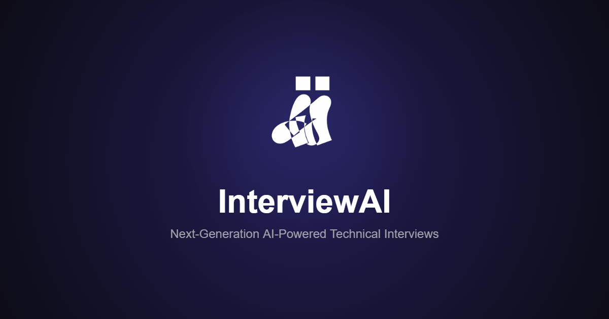

# InterviewAI 🚀

> A production-ready, AI-powered technical interview platform engineered for seamless real-time collaboration, dynamic problem generation, and instant code reviews.



## 🌟 Features

*   **Real-time Collaborative Code Editor**: Powered by Monaco Editor, supporting 10+ languages with synchronized execution.
*   **WebRTC Video Conferencing**: Built on LiveKit for ultra-low latency, peer-to-peer video, audio, and screen sharing.
*   **AI Problem Generation**: Uses Google's Gemini 2.5 Flash to dynamically generate custom Data Structures, Algorithms, and System Design problems.
*   **Instant AI Code Reviews**: Provides real-time streaming feedback on Time/Space Complexity, readability, and best practices.
*   **Context-Aware AI Assistant**: A conversational AI that understands your current code and problem statement to offer subtle hints and explanations.
*   **Analytics Dashboard**: Visualizes candidate performance trends, technical scoring, and communication skills using Recharts.
*   **Secure & Rate-limited**: Protected by Supabase Auth and Upstash Redis sliding-window rate limiting.

## 🛠️ Tech Stack

*   **Framework**: [Next.js 15 (App Router)](https://nextjs.org)
*   **Language**: [TypeScript](https://www.typescriptlang.org/)
*   **Authentication & Database**: [Supabase](https://supabase.com)
*   **Real-time Infrastructure**: [LiveKit](https://livekit.io)
*   **AI Integration**: [Vercel AI SDK](https://sdk.vercel.ai/docs) + [Google Gemini](https://ai.google.dev/)
*   **Code Execution Engine**: [Piston API](https://github.com/engineer-man/piston)
*   **Styling & UI**: [Tailwind CSS v4](https://tailwindcss.com), [Shadcn UI](https://ui.shadcn.com/), [Framer Motion](https://www.framer.com/motion/)

## 🚀 Quick Start

### 1. Clone the repository
```bash
git clone https://github.com/YOUR_USERNAME/interview-ai.git
cd interview-ai
npm install
```

### 2. Environment Variables
Create a `.env.local` file in the root directory and populate it with the following:

```env
# Supabase (Auth & Database)
NEXT_PUBLIC_SUPABASE_URL=your_supabase_url
NEXT_PUBLIC_SUPABASE_ANON_KEY=your_supabase_anon_key

# LiveKit (WebRTC & Video)
LIVEKIT_API_KEY=your_livekit_api_key
LIVEKIT_API_SECRET=your_livekit_api_secret
NEXT_PUBLIC_LIVEKIT_URL=your_livekit_wss_url

# Google Gemini (AI Features)
GOOGLE_GENERATIVE_AI_API_KEY=your_gemini_api_key

# Upstash Redis (Global Rate Limiting)
UPSTASH_REDIS_REST_URL=your_upstash_url
UPSTASH_REDIS_REST_TOKEN=your_upstash_token

# App
NEXT_PUBLIC_APP_URL=http://localhost:3000
```

### 3. Database Setup
Run the SQL script located in `database.sql` within your Supabase SQL Editor. This will provision the necessary `profiles`, `interviews`, `feedback`, and `analytics` tables with their corresponding Row Level Security (RLS) policies.

### 4. Start Development Server
```bash
npm run dev
```
Open [http://localhost:3000](http://localhost:3000) to view the application.

## 🔒 Architecture & Security

*   **Middleware Protection**: `src/middleware.ts` intercepts all requests, redirecting unauthenticated users and enforcing a strict 10 requests / 10 seconds sliding window rate limit via Upstash Redis.
*   **Row Level Security (RLS)**: Supabase policies strictly isolate user data. Candidates can only read/update their own interview sessions.
*   **Server-Side Execution**: Code compilation is safely offloaded to the containerized Piston API, entirely preventing malicious local execution.

## 📈 Deployment

InterviewAI is optimized for Vercel.

1. Push your code to a GitHub repository.
2. Import the project into Vercel.
3. Add all environment variables from your `.env.local` to the Vercel project settings.
4. Deploy!

## 🧑‍💻 Author

Built by Poosaala Soumith
- LinkedIn: https://www.linkedin.com/in/poosaalasoumith/
- GitHub: https://github.com/poosaalasoumith
